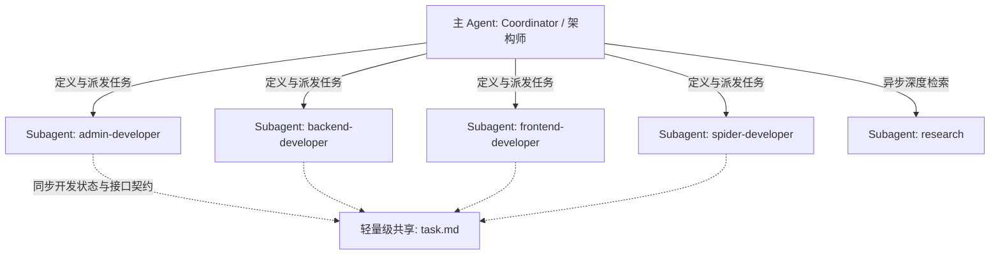

# 🚀 createRemoteWeb3 项目智能开发与调度 Skill

本 Skill 旨在指导 AI Agent（主/从 Agent）高效、低消耗、高质量地协作开发、测试与部署 **remoteweb3.com** —— 一个顶级的远程 Web3 招聘平台。本系统由四个互相协作的子项目构成，并使用统一的容器化技术进行一键部署。

---

## 🎯 1. 核心架构与端口分配规范

为确保服务间通信流畅、配置清晰，各模块的技术选型与端口分配必须严格遵守以下规范：

| 模块名称 | 物理路径 | 核心技术栈 | 服务端口 | 职责描述 |
| :--- | :--- | :--- | :--- | :--- |
| **admin** | `./admin` | React + [Arco Design](https://arco.design/) | `6001` | **后台管理系统**：提供开箱即用的岗位审核、爬虫配置、统计看板与用户权限管理。 |
| **backend** | `./backend` | Bun + Hono + MySQL + Nginx | `6002` | **后端 API 服务**：高并发轻量级 API 网关、JWT 鉴权、数据库核心逻辑与 Nginx 反向代理。 |
| **frontend** | `./frontend` | Next.js + Vanilla CSS | `6003` | **极速求职前端**：极致的 SEO 优化、Lighthouse 满分级速度、现代轻奢 UI（暗黑模式/渐变玻璃态）。 |
| **spider** | `./spider` | Bun + Crawler 框架 + AI SDK (DeepSeek V4 Pro) | `6004` | **智能招聘爬虫**：拥有可视化管理界面，支持单任务/批量抓取前20名 Web3 网站数据，通过 AI 清洗入库。 |

---

## 🧠 2. 主从 Agent 调度模式（Orchestration Framework）

随着项目规模的扩大，在一个对话上下文中完成四个系统的开发会导致 Context Window 被严重挤爆，推理精度急剧下降。因此，本 Skill 强制推行**主从 Agent（Coordinator & Subagents）调度模式**：



### 👥 角色分工与定义

1. **主 Agent (Coordinator)**
   - **职责**：高层系统设计、API 契约定义（OpenAPI/Swagger）、子任务派发、全局 Docker-Compose 编排以及集成测试。
   - **核心工具**：`define_subagent`、`invoke_subagent`、`send_message`。
2. **专属子 Agent (Specialized Subagents)**
   - **`admin-developer`**：专精 React 和 Arco Design，独立负责管理后台的业务组件与交互逻辑。
   - **`backend-developer`**：专精 Bun、Hono 与 MySQL，设计高性能表结构与严谨的 Restful API。
   - **`frontend-developer`**：专精 Next.js 与现代化 CSS 动效，设计具有视觉冲击力且兼顾 SEO 指标的页面。
   - **`spider-developer`**：结合 `ai` 和 `@ai-sdk/deepseek` 编写数据抓取、格式化、智能分类清洗流水线，并开发可视化爬虫控制面板。

---

## ⚡ 3. 极致 Token 消耗优化策略

在开发庞大项目时，为了防止 Token 浪费并减少上下文噪声，必须遵循以下执行准则：

1. **工作区范围隔离 (Workspace Scoping)**
   - 主 Agent 在调用 `invoke_subagent` 时，对于特定模块的子 Agent，应当将 Workspace 设定为模块子文件夹（如 `frontend`），使其无法读取无关目录，直接物理减半上下文 Token。
2. **渐进式披露原则 (Progressive Disclosure)**
   - **严禁**直接拉取整个项目的大段源码。
   - 每次使用 `view_file` 时，必须结合 `grep_search` 精准定位行号，且读取上限控制在 800 行以内。
   - 优先查阅模块的 API 契约和数据结构定义，而非具体的业务实现。
3. **基于 `task.md` 的轻量状态同步**
   - 避免在主从 Agent 之间传递冗长复杂的对话记录。
   - 主 Agent 只需在根目录下的 `<appDataDir>\brain\<conversation-id>\task.md` 记录整体架构与 API 规范，子 Agent 定期读取此轻量级 Markdown 文件以获取最新状态。
4. **精细化搜索与匹配**
   - 在不知道目标结构时，先使用 `list_dir` 获取目录大纲，再用精准匹配搜索，杜绝盲目大面积读取。

---

## 📦 4. 一键部署与环境管理规范

为了确保应用能方便地完成上线与部署，所有模块均应容器化，并由根目录的 `docker-compose.yml` 统一编排：

* **环境变量存储**：敏感配置与连接串统一放在根目录的 `.env` 中，严禁将明文密码与 Key 提交至 Git 仓库。
* **数据持久化**：MySQL 数据目录、Nginx 日志与爬虫缓存必须配置 Docker Volume 持久化存储。
* **端口转发**：
  - 容器内服务均监听各自容器的对应端口。
  - 主机统一映射：Admin(`6001`), Backend(`6002`), Frontend(`6003`), Spider(`6004`)。

---

## 🛠️ 5. 如何调用与启动运行

### 🚀 步骤一：触发主 Skill 激活
您只需在对话框中发送带有以下意图的信息，Antigravity 即可自动匹配并激活此 Skill：
> *“帮我创建 remoteweb3 应用，并规划开发步骤”* 或 *“启动 createRemoteWeb3 任务，开始开发”*

### 📋 步骤二：主从 Agent 协同开发流水线
主 Agent 被调起后，会按以下顺序执行：
1. **架构契约设计**：在根目录下创建/更新 `api-specs.json` 或 `api-specs.md`，约定四大系统的通信格式。
2. **定义并启动子 Agent**：
   使用 `define_subagent` 声明各专业子 Agent，例如：
   ```json
   {
     "name": "frontend-developer",
     "description": "专精 Next.js 高保真前端开发的子 Agent",
     "system_prompt": "你是一个顶级 Next.js 前端专家。你只负责 E:\\myCodeRepository\\github\\web3job\\frontend 目录下的开发。请注重 UI 动效、SEO 优化与 Lighthouse 性能。..."
   }
   ```
3. **并发任务派发**：通过 `invoke_subagent` 派发具体的模块开发指令，并用 `send_message` 实现高内聚、低耦合的实时状态追踪。
4. **状态汇聚与部署验证**：子 Agent 完成开发后将控制权返还，主 Agent 进行 Docker 编排测试与一键部署。
